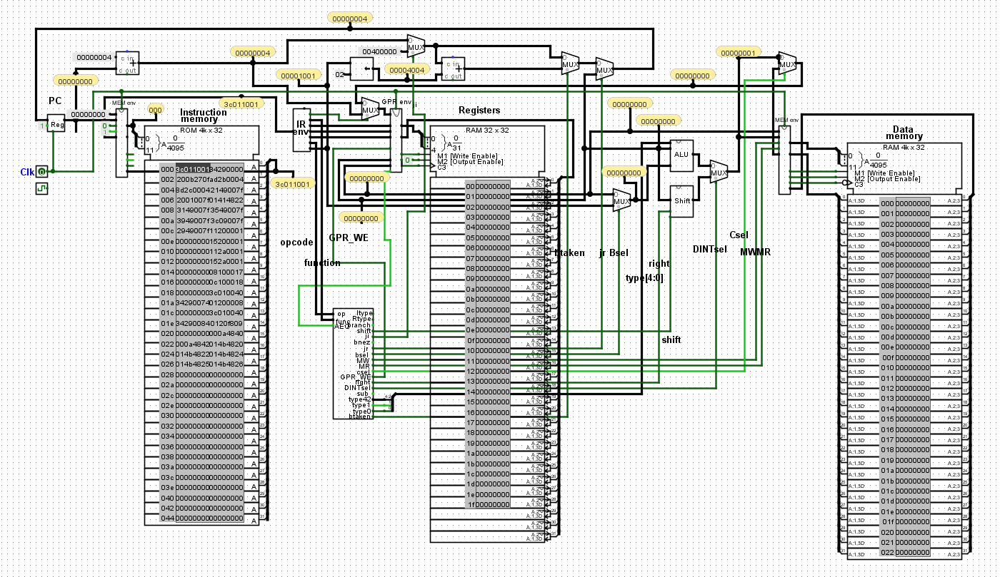

  

Pong is a game that was developed by Atari in the 1970's. It simulates a game of table tennis. Players contorls a paddle which moves vertically and is used to hit a ball back and forth which goes horizontally. Points are awarded when you hit the ball behind your opponents paddle.

In my verson of Pong that I made, it is single player only. This means that there is only 1 paddle on the screen and you play against yourself. If you let the ball go behind your paddle the game ends. You get points based now how much times you can hit the ball with your paddle without letting it get past. 

This was built using Logisim and Mars. Logisim is a tool for designing and simulating digital logic circuits and Mars is an IDE for programming in MIPS assembly language. I had build a CPU with many different compenents like the ALU and control unit so that my code from assembly could be translated to work with the simulated hardware. 

I learned a lot from this project, mainly how code is translated to bit's using gates and other hardware related mechanisms. I also learned how a computer functions at its most basic levels and the roles of registers and RAM memory. 

Source: <a href="https://github.com/vialliou/pong"><i class="large github icon "></i>vialliou/pong</a>
