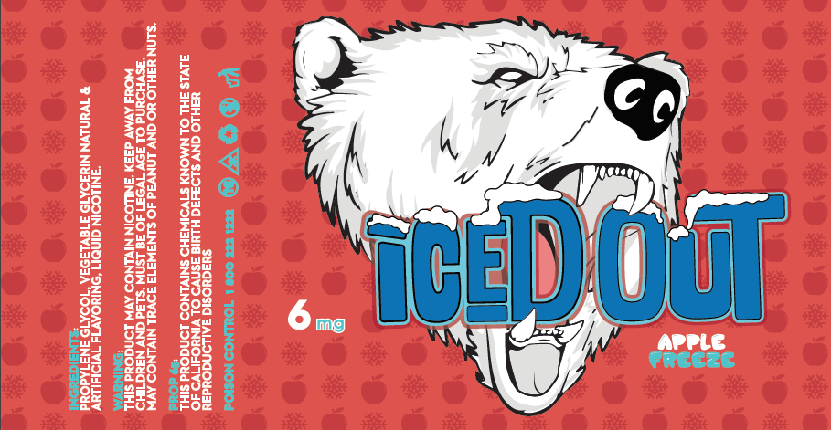

I not only enjoy the challenges of coding, but the challenges of design as well. In my spare time I like to take on freelance design work. I mainy do product logos, product lables and event flyers. I have a also done bigger projects like magazines. My goal is to take the knowledge I have as a programmer and as a designer to make beautiful but also functional interfaces for apps or websites. 
 
Source: <a href="https://github.com/vialliou/logo"><i class="large github icon"></i>vialliou/logo</a>
