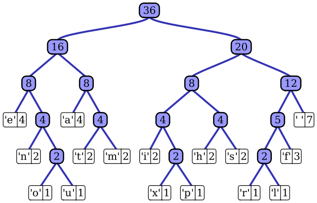

Huffman coding is a lossless data compression algorithm. The idea is to assign codes to input characters. The lengths of the assigned codes are based on the frequencies of corresponding characters. The most frequent character gets the smallest code and the least frequent character gets the largest code.

The two major parts in Huffman Encoding is building a tree from input characters and traversing that tree and assigning code to those characters. This is a project I did in my java that gave me a good understanding of nodes, tree traversal, and a very basic understanding of compression. 

Source: <a href="https://github.com/vialliou/huffman"><i class="large github icon "></i>vialliou/huffman</a>

