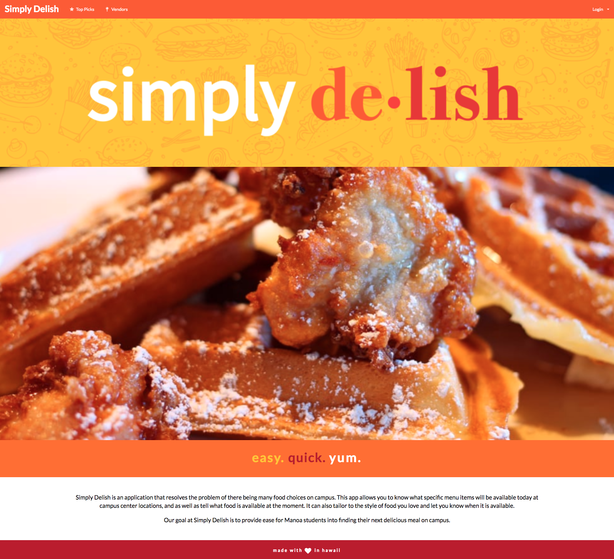

  

Simply Delish is a project I worked on three other memebers. It's an application that allows you to search for specific food items that various vendors offer around our school campus. The goal of this project was to make it easier for students to find their next meal on campus. 

My contributions to this project consisted of both front-end and back-end work. I had a large part in designing and creating the various pages you land on. I also helped in giving funtionality to the app by assisting in creating the back-end to allows users to make accounts that display their apporiate information. Through this project I learned different design patterns as well as how to contribute to a codebase with multiple people working on it and the different challenges that that brings. 

<a href="https://simplydelish.github.io/"><i class="large github icon"></i>Simply Delish Project Page</a>
 
<a href="https://github.com/simplydelish/simplydelish"><i class="large github icon"></i>Simply Delish Source</a>
